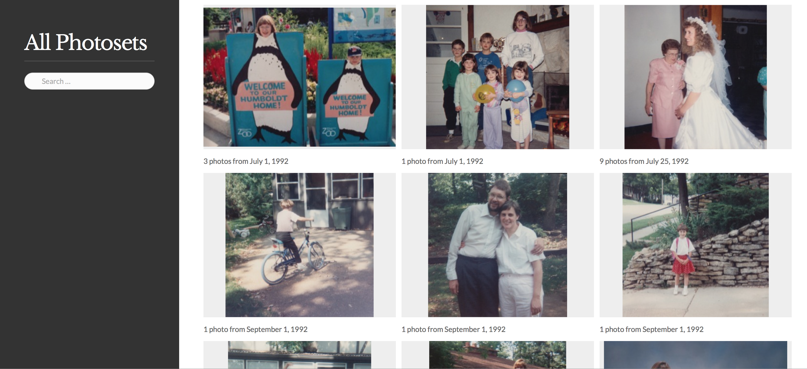
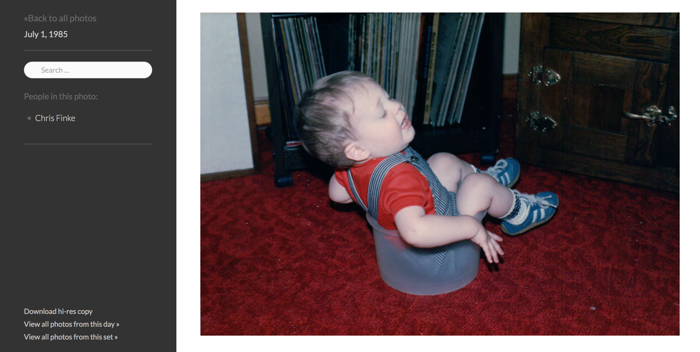

iPhoto Disc Export
==================

Export your iPhoto library as a browsable website that can be burned to a disc and remain completely functional offline or uploaded and served from a website.

This was put together for a one-time-use project, so some of the code was specific to my needs, but you might find it useful as a starting point, a.k.a. don't judge me by the messiness of this code.

Usage
=====

Run it like this:

`$ ./iphotodisc.php --library=/path/to/photo/library --output-dir=/path/for/exported/files [--jpegrescan --start-date=1950-01-01]`

Optional arguments:

* `--jpegrescan`: will invoke `jpegrescan` to optimize the size of the export photos. (Obviously, you must have (`jpegrescan`)[https://github.com/kud/jpegrescan] installed.) This will take a long time.
* `--start-date=YYYY-MM-DD`: will limit the export to photos from on or after that date.
* `--end-date=YYYY-MM-DD`: will limit the export to photos from on or before that date.
* `--timezone=[PHP timezone identifier]: Sets the timezone that the script should use for considering photo dates.

You may specify multiple `--library` arguments to export photos from multiple libraries:

`$ ./iphotodisc.php --library=/path/to/photo/library --library=/path/to/photo/library2 --output-dir=/path/for/exported/files [--jpegrescan --start-date=1950-01-01 --end-date=1955-01-01]`

The Website
===========
The resulting website groups photos into their events and supports searching on photo title, description, date, and faces. Everything is ordered by date ascending. (Feel free to add sorting options and send me a patch.)

Here's how the main page of the website looks:

Each photo shows the photo description, date, and list of people in the photo. Here's a photo page:

The search query syntax supports JavaScript-style regex, quoted strings, and exclusions. For example, this:

`"Becky Smith" -"John Smith" [0-9]{4}-03`

would return all photos mentioning or including Becky Smith that do not mention or include John Smith that were taken in March of any year.

Misc
====

This repository contains a number of projects that are developed elsewhere:

* The libraries `photolibrary` and `CFPropertyList` are included for convenience but the canonical repositories can be found at https://github.com/cfinke/photolibrary and https://github.com/rodneyrehm/CFPropertyList respectively.
* CSS and JS from the great [Studio theme by Pixel Union](http://studio-theme.pixelunion.net/) is also used for the generated website.
* The jQuery lazyload plugin lives at http://www.appelsiini.net/projects/lazyload
* jQuery: http://jquery.com/
* modernizr.js: http://modernizr.com
* Lato fonts: http://www.latofonts.com/lato-free-fonts/
* Open Baskerville font: http://klepas.org/openbaskerville/
